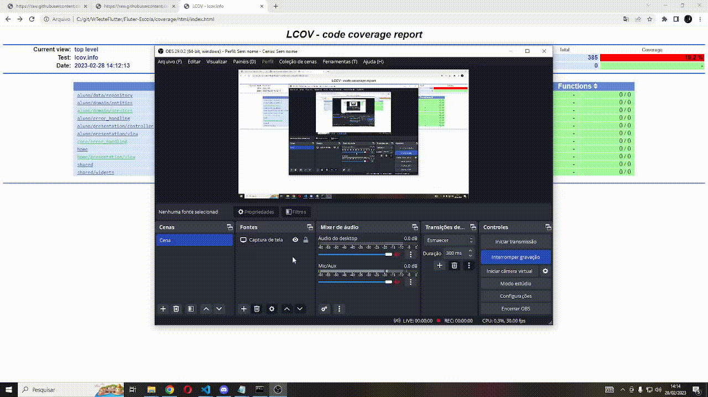

# Escola

Projeto flutter para cadastro de curso aluno e matricular aluno em curso.
É possível adicionar, excluir e alterar curso e aluno, para deletar deve-se olhar se o curso não tem nenhum aluno matriculado e para aluno se ele não está matriculado em um curso.
Para realizar uma matricula deve-se acessar o menu na pagina inicial "Cursos" clickar em um curso lista e acionar o floating action button para listar alunos que nao estao no curso, podendo utilizar o checkbox para adicionar mais de um ao mesmo tempo e salvar.

## Consultar Servidor

Esta sendo chamado o servidor criado aqui em outro repositório "Node -escola" rodando o mesmo em maquina local.

## Testes

### Lcov

    

Foi utilizado o lcov junto o flutter test coverage para mapear e facilitar a visualização da cobertura de teste do projeto (conforme gif acima).

### Widgets

Foi implementado um teste widgets para a pagina de home_page.dart validando a rota com o modular.

### Snapshot(golden)

Foi implementado um teste de snapshot para a pagina de home_page.dart.

### Unitários

Foi implementado um teste unitário para testar get_aluno_service_test.dart.

## Animação

Criado uma animação para exemplo, animated_bottom_sheet.dart, que exibe um bottom sheet animado quando um curso ou aluno não pode ser excluído.

## Arquitetura

Aplicado conceitos de arquiterura limpa, como base um MVP.
Utilizado o flutter_modular para organização por modulos.
## Melhorias

Devido ao tempo não foram implementados:
 - Consulta dos dados no servidor para o gráfico, então sendo no momento com dados mocados para exemplificar.
 - Implementar funcionalidade de pesquisa na lista de alunos para filtros por nome.
 - Componentizar melhor as telas.

